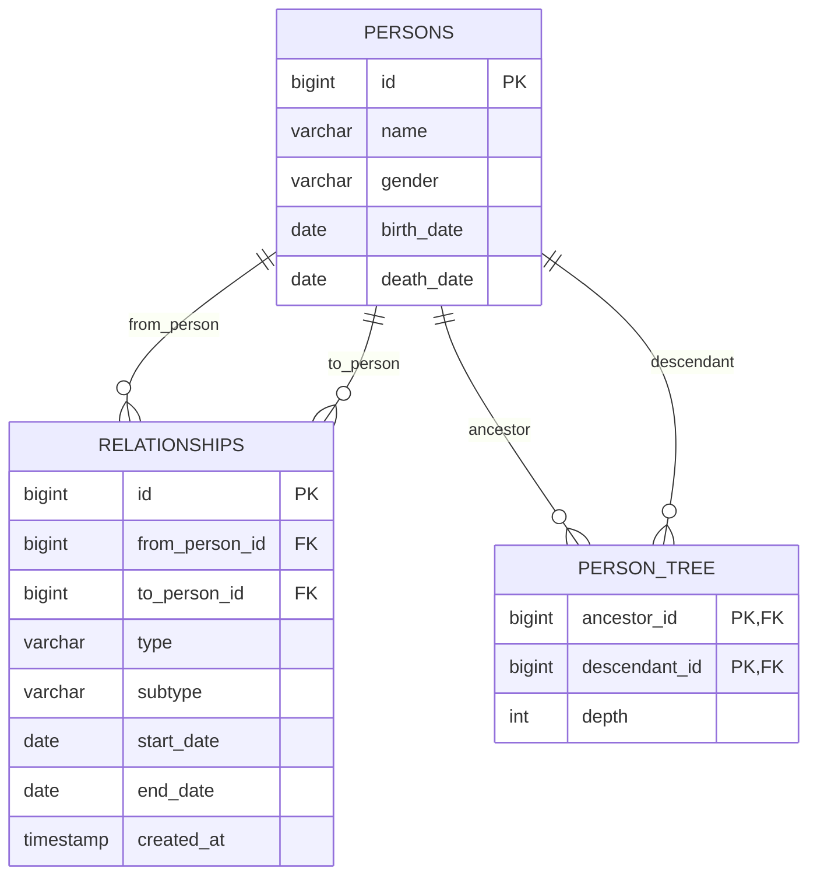

# 🗂️ Entity Relationship Diagram (ERD)

## Overview

The genealogy system uses a relational database design with three main entities: Persons, Relationships, and Person Tree (for hierarchical queries).

## ERD Diagram

## Relationships

- **Persons → Relationships**: One-to-many (a person can have multiple relationships)
- **Relationships → Persons**: Many-to-one (relationships reference persons)
- **Persons → Person Tree**: One-to-many (closure table for hierarchy)
- **Person Tree → Persons**: Many-to-one (references persons in hierarchy)

## Key Design Decisions

1. **Closure Table Pattern**: Person Tree uses the closure table pattern for efficient hierarchical queries
2. **Relationship Types**: Flexible type system with enum constraints
3. **Temporal Relationships**: Start/end dates allow for historical relationship tracking
4. **Self-Relationship Prevention**: Database constraints prevent invalid relationships

## Constraints

- No self-relationships (person cannot relate to themselves)
- Unique parent relationships per person pair
- Unique active spouse relationships
- Foreign key constraints maintain referential integrity
